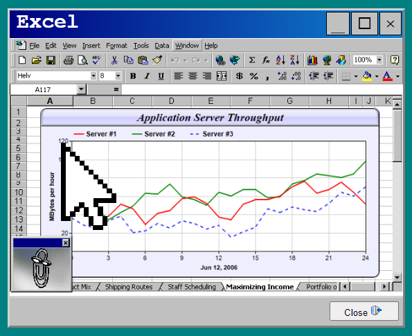

    

<h3 align="center">CursR</h3>

  <a href="../../issues">Report an Issue</a>
  ·
  <a href="../../releases">Releases</a>
  ·
  <a href="/CHANGELOG.md">Change Log</a>

  <a href="#Description">Description</a>

## Description

A proof-of-concept showcasing using a mobile device as a laser point, passing the coordinates via WebRTC thanks to [peer.js](https://peerjs.com/).  

CursR has a multitude of use-cases, from presentations, to media controls, to gaming. 

Very much a work in progress

## Outstanding issues/features
Date | Issue/Feature
:--: | -----
17/08/2024 | Finish help pages
17/08/2024 | Tidy/refactor JS 
17/08/2024 | Refactor all on click events
17/08/2024 | Split out images and resources
17/08/2024 | Add better error handling
17/08/2024 | Disconnect cursr on sender
17/08/2024 | Check orientation - use relevant fields	
17/08/2024 | Fade On Inactive
17/08/2024 | Add gamma control (tilt cursor)
17/08/2024 | Allow cursor to get to edge (use cursor point not sides)
17/08/2024 | Add mouse over, etc. events
17/08/2024 | Implement media player/remote control
17/08/2024 | Create base class for comms (and share with other projects)
17/08/2024 | Implement max/min window in modal
17/08/2024 | Save high score(s) in game (add initials) - save locally
17/08/2024 | Stop game on close
17/08/2024 | Add game status
17/08/2024 | Better callibrate for cursor
17/08/2024 | Make mobile friendly
17/08/2024 | Close start menu on app open